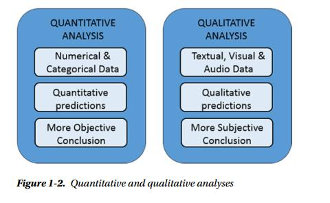

# 第一章
## 1.1数据分析

什么是数据，数据不同于信息。信息实际上是对数据集进行处理，从中提炼出可用于其他场合的结论，也就是说，它是对数据进行处理后得到的结果。从原始数据中抽取信息的这个过程就叫做**数据分析**。

数据分析的目的正是抽取不易推断的信息，而一旦理解了这些信息，就能够对产生数据的系统的运行机制进行研究，从而对系统可能的响应和演变做出预测。

数据分析最初用于数据保护，现在已经发展成为数据建模的方法论，从而完成了到一门真正科学的转变。模型实际上是指将所研究的系统转化为数学形式。一旦建立数学或逻辑模型，对系统的响应能做出不同精度的预测，我们就可以预测在给定输入的情况下，系统会给出怎样的输出。这样看来，数据分析的目的不止是建模，更重要的是其预测能力。

模型的预测能力不仅取决于建模技术的质量，还取决于选择分析使用的优质数据集的能力。因此数据搜索、数据提取、数据准备也是属于数据分析的范畴，他们对最终结果有重要影响。

在数据分析的各个阶段还是有各种各样的数据可视化方法。无论是孤立的看数据，还是将其放到整个数据集来看，理解数据的最好的方法莫过于将其做成可视化的图形，从而传达出数字中蕴含的信息。

数据分析的产出为模型和图形化展示，据此可预测所研究系统的响应。随后进入测试阶段，用已知输出结果的一个数据集对模型进行测试。这些数据不是用来生成模型的，而是用来检验系统给的能否重现实际观察到的输出，从而掌握模型的误差，了解其有效性和局限。

拿新模型的测试结果与既有模型进行对比便可知道优劣。如果新模型胜出，既可尽心该数据分析的最后一步，部署。部署阶段需要根据摩西个给出的预测结果，实现相应的决策，同时还要防范模型预测到的潜在风险。

##  1.2数据分析师的知识范畴
1. 计算机科学
2. 数据和统计学
3. 机器学习和人工智能
4. 数据来源领域

## 1.3理解数据的性质
数据 -> 信息 -> 知识

## 1.4数据分析过程
数据分析过程可以用下图表示

- 问题定义
- 数据抽取
- 数据清洗
- 数据转换
- 数据探索
- 预测模型
- 模型评估/测试
- 结果可视化和阐释
- 解决方案部署

## 1.5 定量和定性数据分析

## 1.6 开放数据源

[开放数据源](https://sundaygeek.github.io/2018/04/11/%E5%BC%80%E6%94%BE%E6%95%B0%E6%8D%AE%E6%BA%90/)

## 1.7 python和数据分析
python大量的库为数据分析和处理提供了完整的工具集，也广泛应用于科学计算领域。

# 第2章-ptyhon世界简介

这一章主要是回顾一些python的知识点。

第2章　Python世界简介　　12
2.1　Python——编程语言　　12
2.2　Python——解释器　　13
2.2.1　Cython　　14
2.2.2　Jython　　14
2.2.3　PyPy　　14
2.3　Python 2和Python 3　　14
2.4　安装Python　　15
2.5　Python发行版　　15
2.5.1　Anaconda　　15
2.5.2　Enthought Canopy　　16
2.5.3　Python(x,y)　　17
2.6　使用Python　　17
2.6.1　Python shell　　17
2.6.2　运行完整的Python程序　　17
2.6.3　使用IDE编写代码　　18
2.6.4　跟Python交互　　18
2.7　编写Python代码　　18
2.7.1　数学运算　　18
2.7.2　导入新的库和函数　　19
2.7.3　函数式编程　　21
2.7.4　缩进　　22
2.8　IPython　　23
2.8.1　IPython shell　　23
2.8.2　IPython Qt-Console　　24
2.9　PyPI仓库——Python包索引　　25
2.10　多种Python IDE　　26
2.10.1　IDLE　　26
2.10.2　Spyder　　27
2.10.3　Eclipse（pyDev）　　27
2.10.4　Sublime　　28
2.10.5　Liclipse　　29
2.10.6　NinjaIDE　　29
2.10.7　Komodo IDE　　29
2.11　SciPy　　30
2.11.1　NumPy　　30
2.11.2　pandas　　30
2.11.3　matplotlib　　31
2.12　小结　　31

# 第3章　NumPy库　　32
3.1　NumPy简史　　32
3.2　NumPy安装　　32
3.3　ndarray：NumPy库的心脏　　33
3.3.1　创建数组　　34
3.3.2　数据类型　　34
3.3.3　dtype选项　　35
3.3.4　自带的数组创建方法　　36
3.4　基本操作　　37
3.4.1　算术运算符　　37
3.4.2　矩阵积　　38
3.4.3　自增和自减运算符　　39
3.4.4　通用函数　　40
3.4.5　聚合函数　　40
3.5　索引机制、切片和迭代方法　　41
3.5.1　索引机制　　41
3.5.2　切片操作　　42
3.5.3　数组迭代　　43
3.6　条件和布尔数组　　45
3.7　形状变换　　45
3.8　数组操作　　46
3.8.1　连接数组　　46
3.8.2　数组切分　　47
3.9　常用概念　　49
3.9.1　对象的副本或视图　　49
3.9.2　向量化　　50
3.9.3　广播机制　　50
3.10　结构化数组　　52
3.11　数组数据文件的读写　　53
3.11.1　二进制文件的读写　　54
3.11.2　读取文件中的列表形式数据　　54
3.12　小结　　55
# 第4章　pandas库简介　　56
4.1　pandas：Python数据分析库　　56
4.2　安装　　57
4.2.1　用Anaconda安装　　57
4.2.2　用PyPI安装　　58
4.2.3　在Linux系统的安装方法　　58
4.2.4　用源代码安装　　58
4.2.5　Windows模块仓库　　59
4.3　测试pandas是否安装成功　　59
4.4　开始pandas之旅　　59
4.5　pandas数据结构简介　　60
4.5.1　Series对象　　60
4.5.2　DataFrame对象　　66
4.5.3　Index对象　　72
4.6　索引对象的其他功能　　74
4.6.1　更换索引　　74
4.6.2　删除　　75
4.6.3　算术和数据对齐　　77
4.7　数据结构之间的运算　　78
4.7.1　灵活的算术运算方法　　78
4.7.2　DataFrame和Series对象之间的运算　　78
4.8　函数应用和映射　　79
4.8.1　操作元素的函数　　79
4.8.2　按行或列执行操作的函数　　80
4.8.3　统计函数　　81
4.9　排序和排位次　　81
4.10　相关性和协方差　　84
4.11　NaN数据　　85
4.11.1　为元素赋NaN值　　85
4.11.2　过滤NaN　　86
4.11.3　为NaN元素填充其他值　　86
4.12　等级索引和分级　　87
4.12.1　重新调整顺序和为层级排序　　89
4.12.2　按层级统计数据　　89
4.13　小结　　90
# 第5章　pandas：数据读写　　91
5.1　I/O API 工具　　91
5.2　CSV和文本文件　　92
5.3　读取CSV或文本文件中的数据　　92
5.3.1　用RegExp解析TXT文件　　94
5.3.2　从TXT文件读取部分数据　　96
5.3.3　往CSV文件写入数据　　97
5.4　读写HTML文件　　98
5.4.1　写入数据到HTML文件　　99
5.4.2　从HTML文件读取数据　　100
5.5　从XML读取数据　　101
5.6　读写Microsoft Excel文件　　103
5.7　JSON数据　　105
5.8　HDF5格式　　107
5.9　pickle——Python对象序列化　　108
5.9.1　用cPickle实现Python对象序列化　　109
5.9.2　用pandas实现对象序列化　　109
5.10　对接数据库　　110
5.10.1　SQLite3数据读写　　111
5.10.2　PostgreSQL数据读写　　112
5.11　NoSQL数据库MongoDB数据读写　　114
5.12　小结　　116
# 第6章　深入pandas：数据处理　　117
6.1　数据准备　　117
6.2　拼接　　122
6.2.1　组合　　124
6.2.2　轴向旋转　　125
6.2.3　删除　　127
6.3　数据转换　　128
6.3.1　删除重复元素　　128
6.3.2　映射　　129
6.4　离散化和面元划分　　132
6.5　排序　　136
6.6　字符串处理　　137
6.6.1　内置的字符串处理方法　　137
6.6.2　正则表达式　　139
6.7　数据聚合　　140
6.7.1　GroupBy　　141
6.7.2　实例　　141
6.7.3　等级分组　　142
6.8　组迭代　　143
6.8.1　链式转换　　144
6.8.2　分组函数　　145
6.9　高级数据聚合　　145
6.10　小结　　148
# 第7章　用matplotlib实现数据可视化　　149
7.1　matplotlib库　　149
7.2　安装　　150
7.3　IPython和IPython QtConsole　　150
7.4　matplotlib架构　　151
7.4.1　Backend层　　152
7.4.2　Artist层　　152
7.4.3　Scripting层（pyplot）　　153
7.4.4　pylab和pyplot　　153
7.5　pyplot　　154
7.5.1　生成一幅简单的交互式图表　　154
7.5.2　设置图形的属性　　156
7.5.3　matplotlib和NumPy　　158
7.6　使用kwargs　　160
7.7　为图表添加更多元素　　162
7.7.1　添加文本　　162
7.7.2　添加网格　　165
7.7.3　添加图例　　166
7.8　保存图表　　168
7.8.1　保存代码　　169
7.8.2　将会话转换为HTML文件　　170
7.8.3　将图表直接保存为图片　　171
7.9　处理日期值　　171
7.10　图表类型　　173
7.11　线性图　　173
7.12　直方图　　180
7.13　条状图　　181
7.13.1　水平条状图　　183
7.13.2　多序列条状图　　184
7.13.3　为pandas DataFrame生成多序列条状图　　185
7.13.4　多序列堆积条状图　　186
7.13.5　为pandas DataFrame绘制堆积条状图　　189
7.13.6　其他条状图　　190
7.14　饼图　　190
7.15　高级图表　　193
7.15.1　等值线图　　193
7.15.2　极区图　　195
7.16　mplot3d　　197
7.16.1　3D曲面　　197
7.16.2　3D散点图　　198
7.16.3　3D条状图　　199
7.17　多面板图形　　200
7.17.1　在其他子图中显示子图　　200
7.17.2　子图网格　　202
7.18　小结　　204
# 第8章　用scikit-learn库实现机器学习　　205
8.1　scikit-learn库　　205
8.2　机器学习　　205
8.2.1　有监督和无监督学习　　205
8.2.2　训练集和测试集　　206
8.3　用scikit-learn实现有监督学习　　206
8.4　Iris数据集　　206
8.5　K-近邻分类器　　211
8.6　Diabetes数据集　　214
8.7　线性回归：最小平方回归　　215
8.8　支持向量机　　219
8.8.1　支持向量分类　　219
8.8.2　非线性SVC　　223
8.8.3　绘制SVM分类器对Iris数据集的分类效果图　　225
8.8.4　支持向量回归　　227
8.9　小结　　229
# 第9章　数据分析实例——气象数据　　230
9.1　待检验的假设：靠海对气候的影响　　230
9.2　数据源　　233
9.3　用IPython Notebook做数据分析　　234
9.4　风向频率玫瑰图　　246
9.5　小结　　251
# 第10章　IPython Notebook内嵌JavaScript库D3　　252
10.1　开放的人口数据源　　252
10.2　JavaScript库D3　　255
10.3　绘制簇状条状图　　259
10.4　地区分布图　　262
10.5　2014年美国人口地区分布图　　266
10.6　小结　　270
# 第11章　识别手写体数字　　271
11.1　手写体识别　　271
11.2　用scikit-learn识别手写体数字　　271
11.3　Digits数据集　　272
11.4　学习和预测　　274
11.5　小结　　276

附录A　用LaTeX编写数学表达式　　277
附录B　开放数据源　　287
