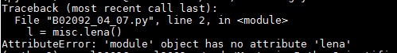

scipy.misc.lena AttributeError: 'module' object has no attribute 'lena'
在数据可视化的那本书上看到的demo，不过运行不通过，然后出现上面的那个错误，lena函数看起来被移除了。

```
    import scipy.misc
    lena=scipy.misc.lena()
    plt.gray()
    plt.imshow(lena)
    plt.colorbar()
    plt.show()
```

Error：
lena=scipy.misc.lena()
AttributeError: 'module' object has no attribute 'lena'



在scipy 1.0.0版本上已经移除了lena图的数据了。 
 
不过替换了一张其他的图片。 在misc目录下看到一个叫ascent的data， 替换这个函数后： 
scipy.misc.ascent()
后，显示一个楼梯的图片。只能凑合着用吧。 lena图自己上网找一张然后数字化就好了。
