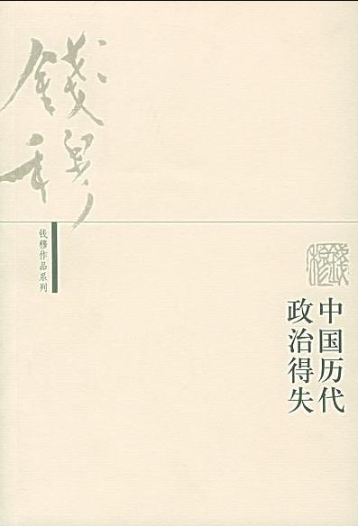
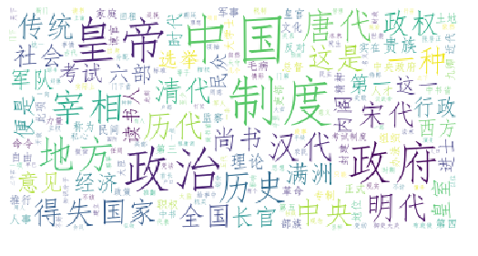

# 封面

# 简介
我很早以前，就想写一部中国政治制度史。一则我认为政治乃文化体系中一要目。尤其如中国，其文化精神偏重在人文界。更其是儒家的抱负，一向着重修齐治平。要研究中国传统文化，绝不该忽略中国传统政治。辛亥前后，由于革命宣传，把秦以后政治传统，用专制黑暗四字一笔抹杀。因于对传统政治之忽视，而加深了对传统文化之误解。我们若要平心客观地来检讨中国文化，自该检讨传统政治，这是我想写中国政治制度史之第一因。再则我认为政治制度，必然得自根自生。纵使有些可以从国外移来，也必然先与其本国传统，有一番融合媾通，才能真实发生相当的作用。否则无生命的政治，无配合的制度，决然无法长成。换言之，制度必须与人事相配合。辛亥前后，人人言变法，人人言革命，太重视了制度，好像只要建立制度，一切人事自会随制度而转变。因此只想把外国现成制度，模仿抄袭。甚至不惜摧残人事来迁就制度。在新文化运动时期，一面高唱民主，一面痛斥旧传统，旧文化。我们试问是否民主政治可以全不与此一民族之文化传统有关联，而只经几个人的提倡，便可安装得上呢？而且制度是死的，人事是活的，死的制度绝不能完全配合上活的人事。就历史经验论，任何一制度，绝不能有利而无弊。任何一制度，亦绝不能历久而不变。历史上一切以往制度俱如是，当前的现实制度，也何尝不如是。我们若不着重本身人事，专求模仿别人制度，结果别人制度，势必追随他们的人事而变，我们也还得追随而变，那是何等的愚蠢。其实中国历史上以往一切制度传统，只要已经沿袭到一百两百年的，也何尝不与当时人事相配合。又何尝是专出于一二人之私心，全可用专制黑暗四字来抹杀？这是我想写一部中国政治制度史之第二因。但由于国家大局之动荡，私人生活之不安定，而自中国历代政治得失 序己想写的，感到比这一部书更重要的也还有，因此此书终于没有写。一九五二年三四月间，承何敬之先生要我讲演中国历代政治得失，但讲期只有五次，每次只限两小时，又为旅途匆忙，以及其他条件，并不能对历史上传统制度详细陈述，精密发挥，只择汉唐宋明清五代略举大纲。本来想再就讲演记录把在讲演时未及提到的，略事增补。不幸讲演完成，我及负伤养病，在此期间，没有精力对此讲稿，再事改进。只得就原记录稿有与原讲义旨走失处稍稍校正，而其他不再润饰了。将来若偿宿愿，能写出一部较详备的中国政治制度史，则属至幸，而此书得以抢先呈教于读者之前，亦可稍自欣慰，并在此致谢何先生之美意。若无何先生这一番督命，连此小书，也不会有仓促完成之望的。此稿初成，在一九五二年八月我在台中养病时。嗣后又有邀约，请写一本“研究中国历代政治制度”的教材，截稿期限甚迫，乃就此稿稍加修改，如唐代的两税制，明代的赋税制度等，均有若干新资料补入，较原稿稍微充实，然恐尚多疏漏谬误，切盼读者之指正。
一九五五年八月钱穆于香港

# 云图

