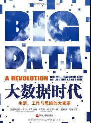
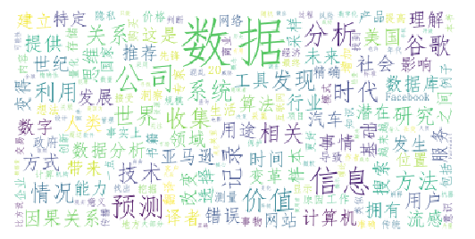

# 封面

# 简介
《大数据时代》是国外大数据研究的先河之作，本书作者维克托•迈尔•舍恩伯格被誉为“大数据商业应用第一人”，拥有在哈佛大学、牛津大学、耶鲁大学和新加坡国立大学等多个互联网研究重镇任教的经历，早在2010年就在《经济学人》上发布了长达14页对大数据应用的前瞻性研究。

维克托•迈尔•舍恩伯格在书中前瞻性地指出，大数据带来的信息风暴正在变革我们的生活、工作和思维，大数据开启了一次重大的时代转型，并用三个部分讲述了大数据时代的思维变革、商业变革和管理变革。

维克托最具洞见之处在于，他明确指出，大数据时代最大的转变就是，放弃对因果关系的渴求，而取而代之关注相关关系。也就是说只要知道“是什么”，而不需要知道“为什么”。这就颠覆了千百年来人类的思维惯例，对人类的认知和与世界交流的方式提出了全新的挑战。

本书认为大数据的核心就是预测。大数据将为人类的生活创造前所未有的可量化的维度。大数据已经成为了新发明和新服务的源泉，而更多的改变正蓄势待发。书中展示了谷歌、微软、亚马逊、IBM、苹果、facebook、twitter、VISA等大数据先锋们最具价值的应用案例。

# 云图

