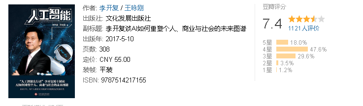
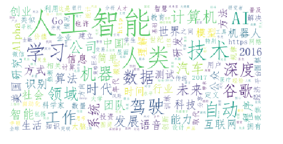

第一章人工智能来了
人类，你好！
无处不在的人工智能
到底什么是人工智能？

第二章AI复兴：深度学习+大数据=人工智能
第三次AI热潮：有何不同？
图灵测试与第一次AI热潮
语音识别与第二次AI热潮
深度学习携手大数据引领第三次AI热潮

第三章人机大战：AI真的会挑战人类？
AlpaG带给人类的启示究竟是什么？
奇点来临？
今天的人工智能还不能做什么？

第四章AI时代：人类将如何变革？
从工业革命到文艺复兴
AI会让人类大量失业吗？
自动驾驶：AI最大的应用场景
智慧金融：AI目前最被看好的落地领域
智慧生活：从机器翻译到智能超市
智慧医疗：AI将成为医生的好帮手
艺术创作：AI与人类各擅胜场
人类将如何变革？

第五章机遇来临：AI先行的创新与创业
大时代，大格局
AI创业是时代的最强音
AI是中国创新、创业的最好机会创新工场的AI布局
第六章迎接未来：AI时代的教育和个人发展
AI时代该如何学习？
AI时代该学什么？
AI时代的教育要关注什么？
有了AI，人生还有意义吗？

