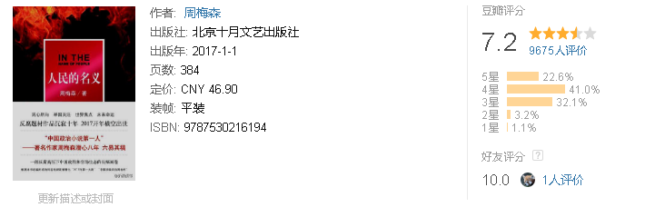

为充分展现中央“坚持以零容忍态度惩治腐败”的反腐精神和国家当前轰轰烈烈、气势如虹的反腐斗争局面，素有“中国政治小说第一人”美誉的著名作家、编剧周梅森先生潜心八年，于2017年再次推出大型现实主义题材长篇力作——《人民的名义》，一部反腐高压下中国政治和官场生态的长幅画卷。本书讲述了最高人民检察院反贪总局侦查处处长侯亮平临危受命，调任地方检察院审查某贪腐案件，与腐败分子进行殊死较量的故事，艺术再现了新时代、新形势下党和国家反腐征程的惊心动魄，深情讴歌了反腐斗士的坚定信仰和无畏勇气，并最终揭示出党的领导干部应如何树立正确的权力观这一宏大的政治主题。

