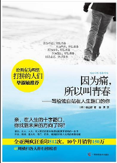
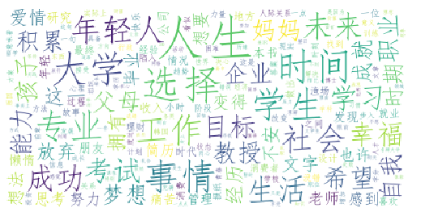

这是韩国青年导师金兰都 “因为痛，所以叫青春系列”的第一部。

《因为痛所以叫青春——写给独自站在人生路口的你》内容简介： 漫漫人生路，一直在迷路。 在一个讲究拼爹的时代，要拼什么才能拼出未来？ 改变亚洲亿万年轻人的疗愈经典。 一位导师父亲写给迷茫孩子的疼痛共鸣。 全亚洲重印512次，10个月销售破150万，45周横扫各大排行榜榜首。 很多时候，在学业上，在工作上，甚至在感情问题上，这些年轻人甚至还没有迈出踏进社会的第一步，就已经沦为一个“loser（失败者）”。在《因为痛所以叫青春——写给独自站在人生路口的你》中作者金兰都如实地把为人父母的成年人们所不曾来得及去了解的这代年轻人的困苦和不安展现了出来。作者帮助他们诊视这些无法向他人倾诉的苦痛，并告诉他们如何才能从这种苦找到为未来打拼的能量。

