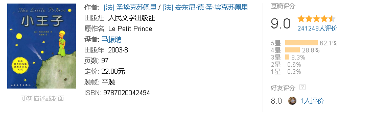
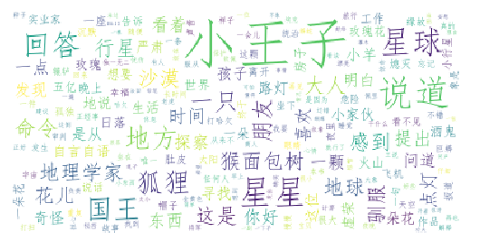

小王子是一个超凡脱俗的仙童，他住在一颗只比他大一丁点儿的小行星上。陪伴他的是一朵他非常喜爱的小玫瑰花。但玫瑰花的虚荣心伤害了小王子对她的感情。小王子告别小行星，开始了遨游太空的旅行。他先后访问了六个行星，各种见闻使他陷入忧伤，他感到大人们荒唐可笑、太不正常。只有在其中一个点灯人的星球上，小王子才找到一个可以作为朋友的人。但点灯人的天地又十分狭小，除了点灯人他自己，不能容下第二个人。在地理学家的指点下，孤单的小王子来到人类居住的地球。

小王子发现人类缺乏想象力，只知像鹦鹉那样重复别人讲过的话。小王子这时越来越思念自己星球上的那枝小玫瑰。后来，小王子遇到一只小狐狸，小王子用耐心征服了小狐狸，与它结成了亲密的朋友。小狐狸把自己心中的秘密——肉眼看不见事务的本质，只有用心灵才能洞察一切——作为礼物，送给小王子。用这个秘密，小王子在撒哈拉大沙漠与遇险的飞行员一起找到了生命的泉水。最后，小王子在蛇的帮助下离开地球，重新回到他的B612号小行星上。

童话描写小王子没有被成人那骗人的世界所征服，而最终找到自己的理想。这理想就是连结宇宙万物的爱，而这种爱又是世间所缺少的。因此，小王子常常流露出一种伤感的情绪。作者圣埃克絮佩里在献辞中说：这本书是献给长成了大人的从前那个孩子。

《小王子》不仅赢得了儿童读者，也为成年人所喜爱，作品凝练的语言渗透了作者对人类及人类文明深邃的思索。它所表现出的讽刺与幻想，真情与哲理，使之成为法国乃至世界上最为著名的一部童话小说。

