爬取[中关村手机网站](http://detail.zol.com.cn/cell_phone_index/subcate57_list_1.html)，获取1716笔数据。

# 型号占比
下图是每一个品牌型号个数的占比图。（注意：次数是型号个数，并不代表销量。）
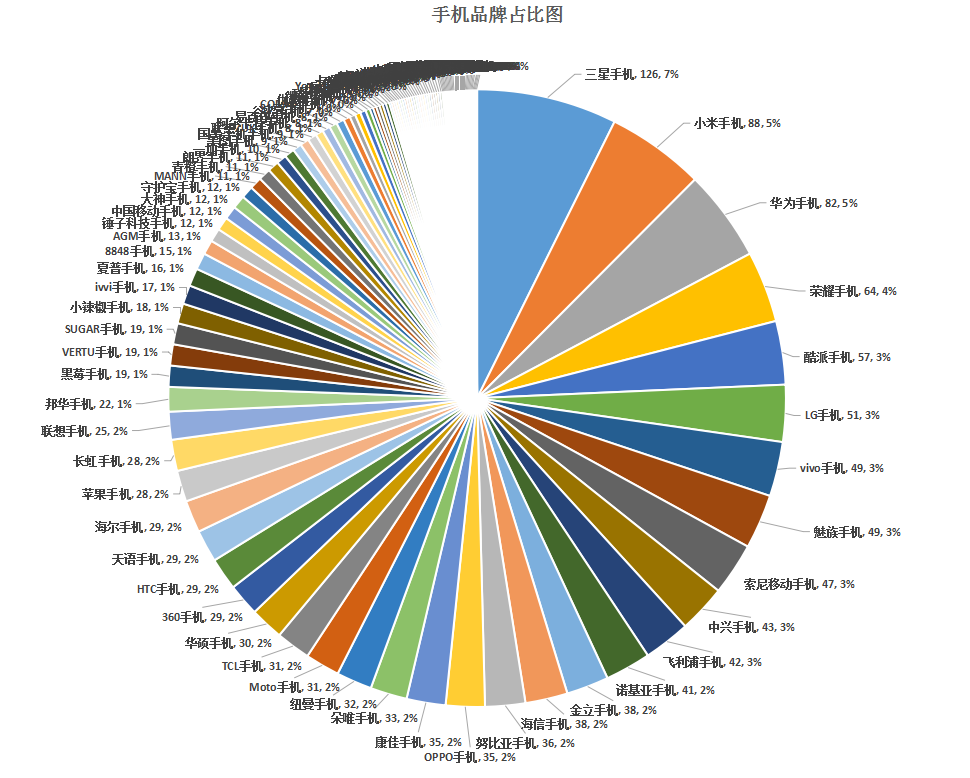

小结：从饼图可以看出，出厂型号最多的Top10的手机品牌为：三星手机, 小米手机, 华为手机, 荣耀手机, 酷派手机, LG手机, vivo手机, 魅族手机, 索尼移动手机, 中兴手机。

# 手机型号个数维度分析
在1716笔数据中，其中372笔没有包含处理器信息，如下图所示。
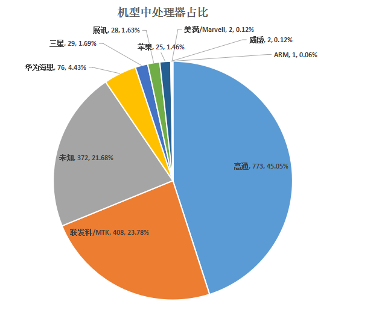

使用处理器最多的Top5是：高通，联发科/MTK，华为海思，三星，展讯。

# 不同厂家使用处理器的选择分析
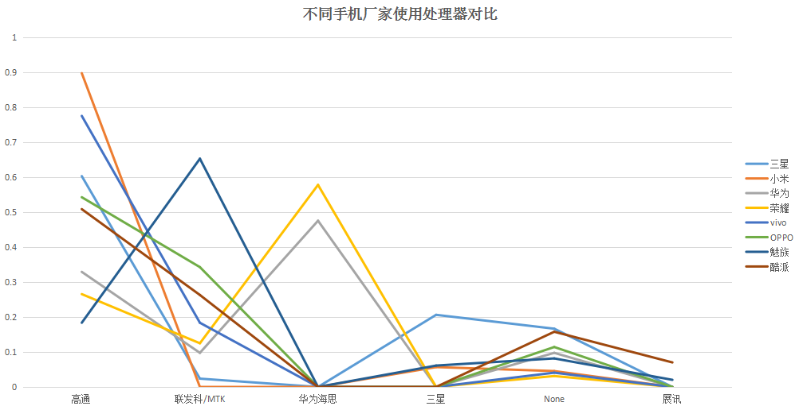
- 高通在大多数厂家中占比较高，在华为、荣耀中占比稍低。
- 魅族对MTK较为偏好
- 华为、荣耀对比海思较为偏好。

# 处理器年度走势
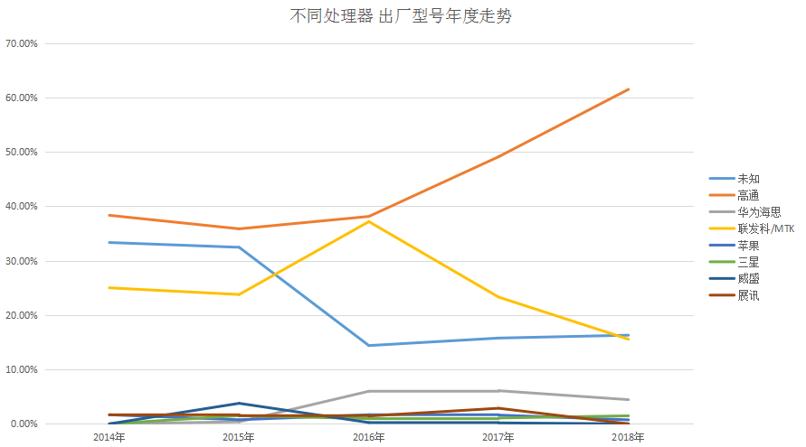

- 高通使用量节节攀升
- MTK趋于减少
- 华为海思较为平缓
- 其余均占比不大

# 处理器维度分析
## 高通处理器
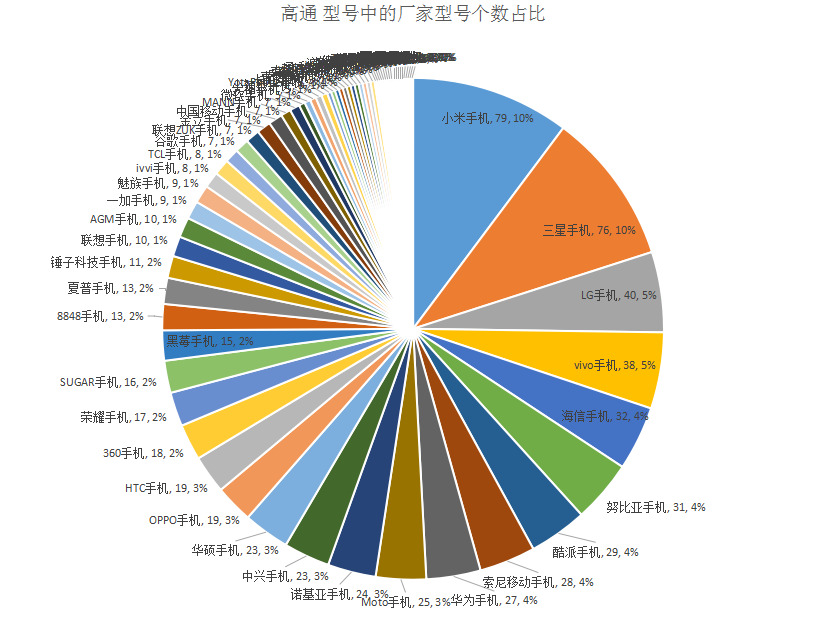

## 联发科MTK
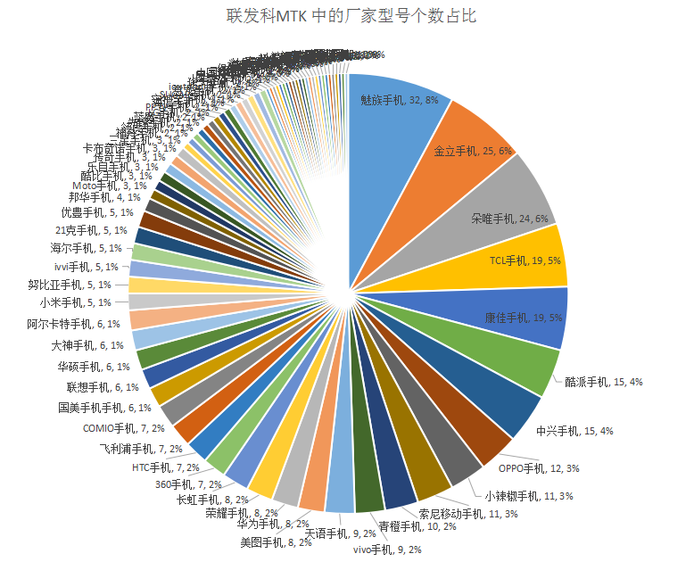

## 华为海思
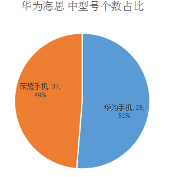
只有华为手机和荣耀手机使用华为海思芯片

## 三星
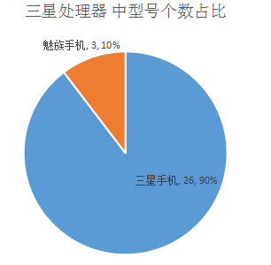
只有三星、魅族使用三星处理器

## 展讯
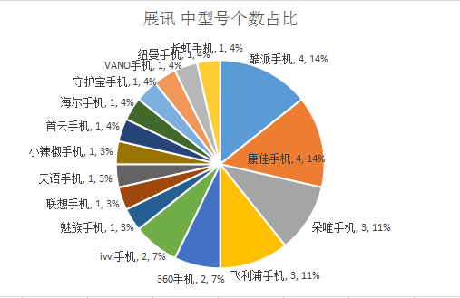
采用展讯芯片的手机多偏向于小品牌。

# 高通处理器热度
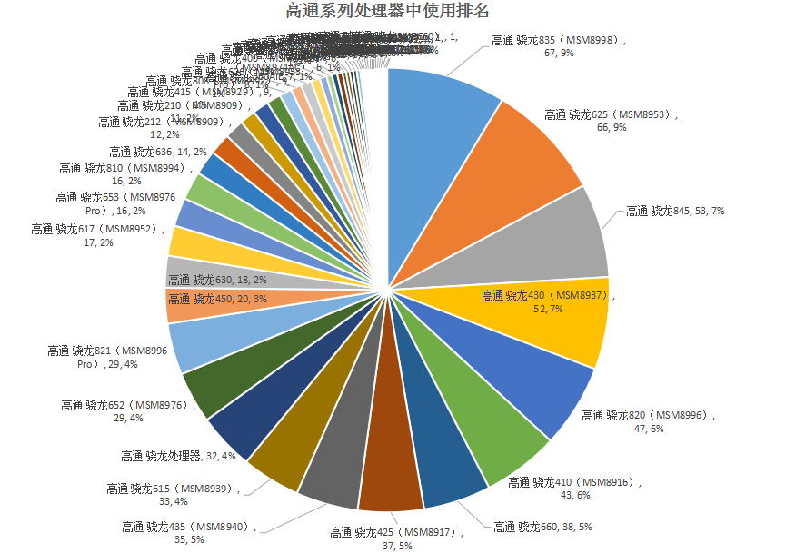
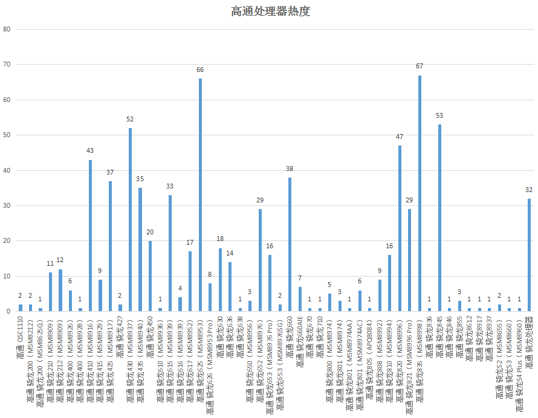
高通处理器中应用范围比较广的处理器有：骁龙835、骁龙625、骁龙845、骁龙430等

# MTK处理器热度
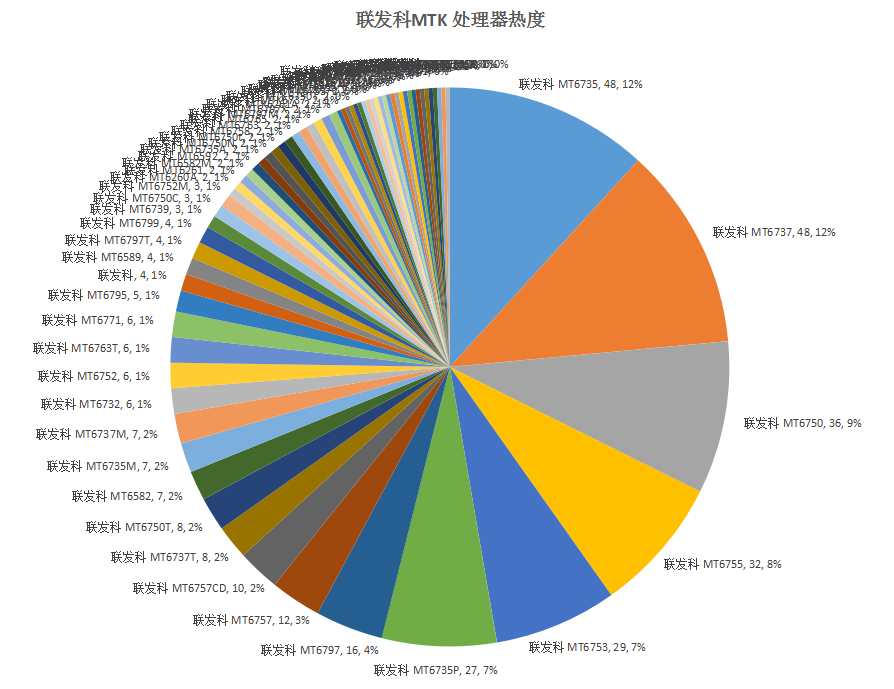
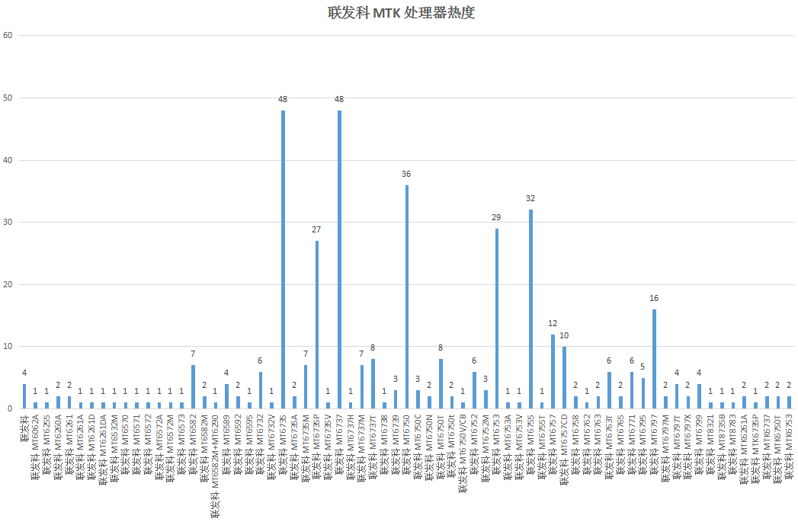
MTK处理器中应用范围较广的有：MT6735/MT6737/MT6750等

# 内存RAM对比
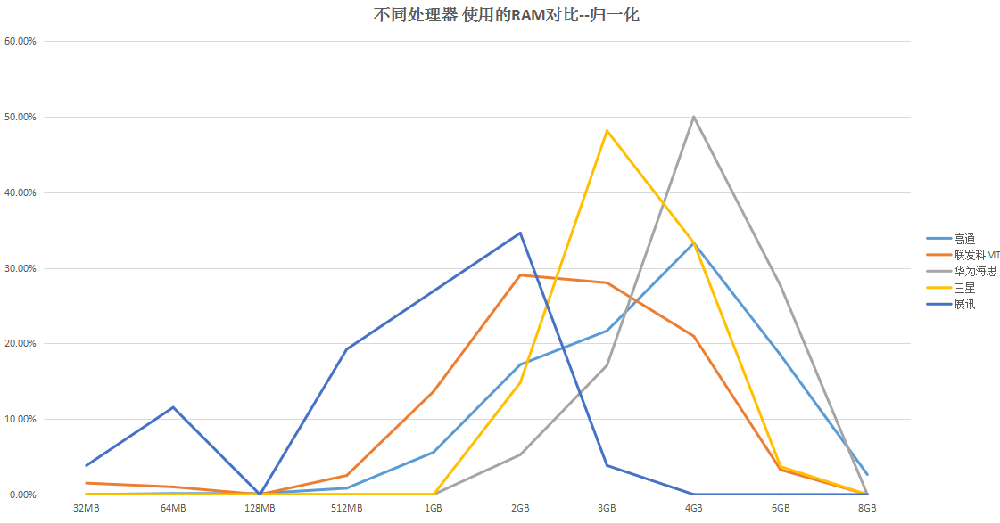
从内存对比来看，使用展讯芯片的手机偏向于低内存，联发科在2-4G，三星在3-4G，高通在2-6G，华为在4-6G。

# 售价对比
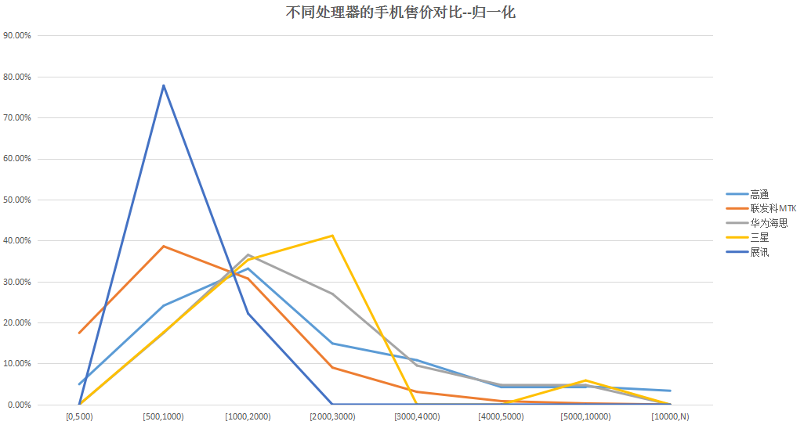
从售价上看，使用展讯芯片的手机售价在1000元以下较多，联发科在200以下的区间，华为海思和高通在500-3000区间都有分布，三星偏向于2000-3000，其中5000以上也有机型分布。

# 时间年份对比
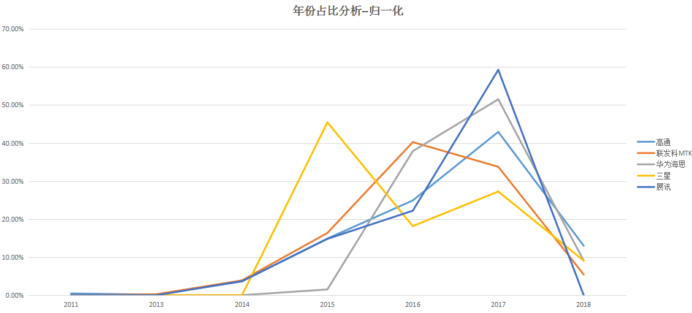
三星处理器2015年峰值，从2016年以来占比逐渐下降，国内几家OEM厂商迅速抢占份额。

# 网络评分
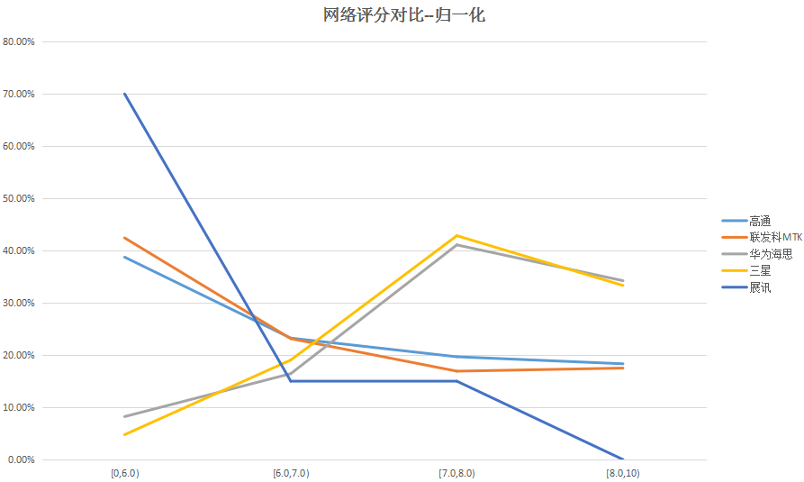
展讯最底、高通和联发科次之、海思和三星较好。

# 网络评论热度
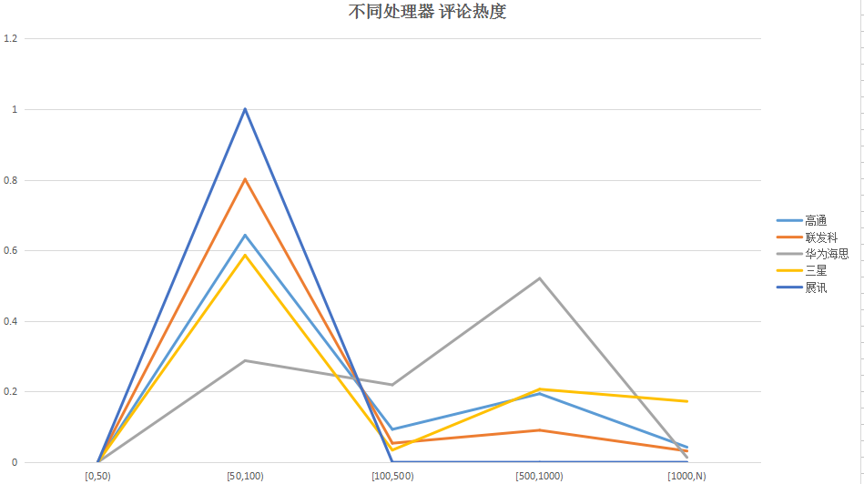
华为海思评论100以上的评论较多。
