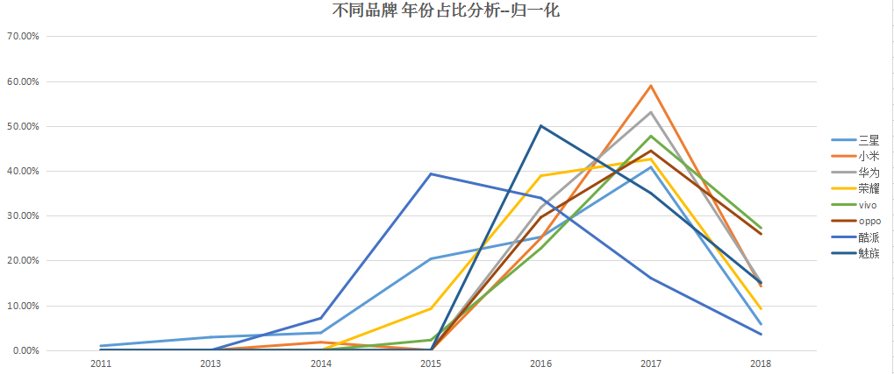

# 不同品牌 机型量占比

# 不同品牌 年份趋势分析

- 三星机型量2015年是最鼎盛时期
- 酷派2016年上市机型量最多

# 不同品牌 网络点评分数分析

# 不同品牌 屏幕尺寸分析

- 大多数厂家偏重5-6寸屏幕，这也是比较舒服的尺寸。
- oppo的则5-7寸均有大量型号

# 不同品牌 RAM分析

# 不同品牌 价格分析

- 荣耀、魅族偏向于500-1000
- vivo、华为 1000-2000

# 不同品牌 网络评论数量分析

- oppo超过10000评论的最多

