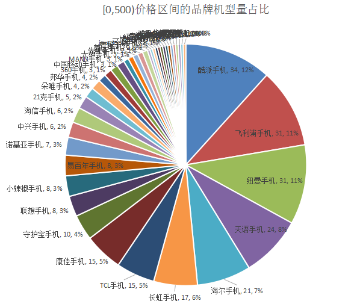
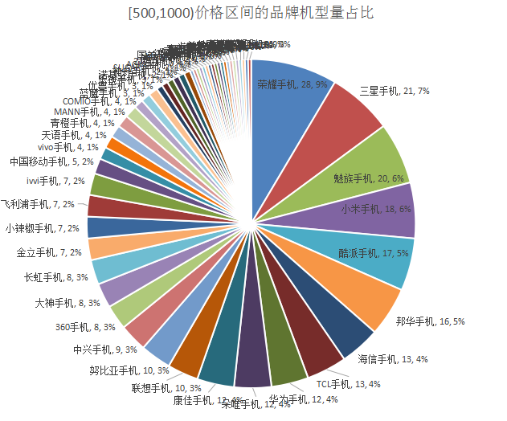
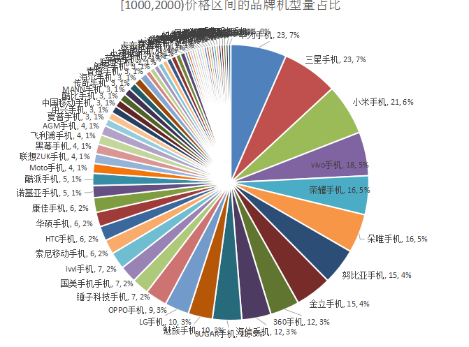
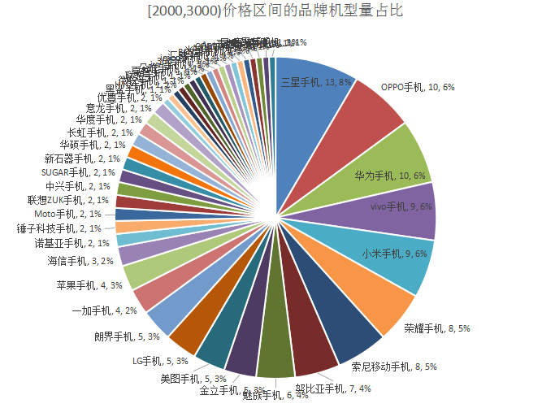
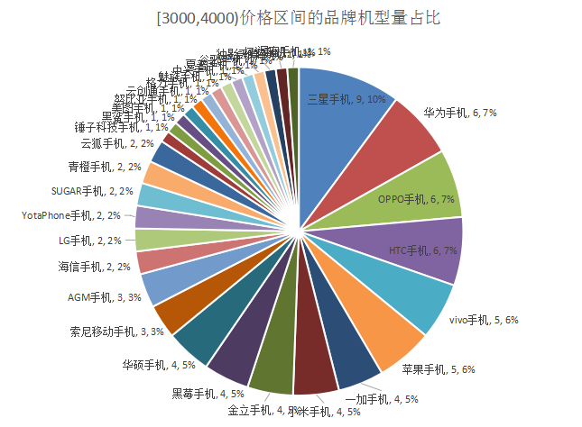
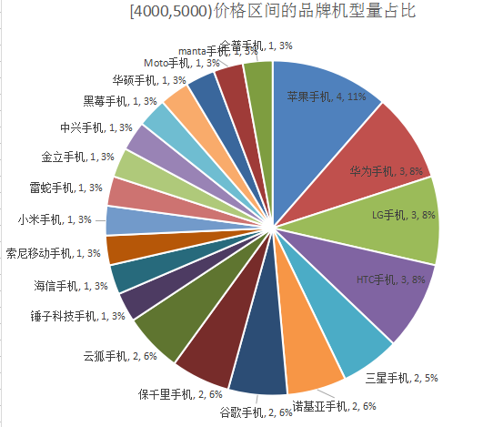
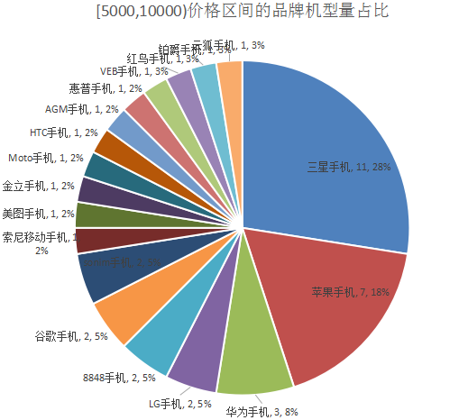
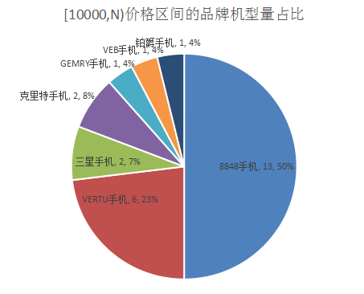

# [0,500)价格区间的品牌机型量占比

# [500,1000)价格区间的品牌机型量占比

# [1000,2000)价格区间的品牌机型量占比

# [2000,3000)价格区间的品牌机型量占比

# [3000,4000)价格区间的品牌机型量占比

# [4000,5000)价格区间的品牌机型量占比

# [5000,10000)价格区间的品牌机型量占比

# [10000,N)价格区间的品牌机型量占比

