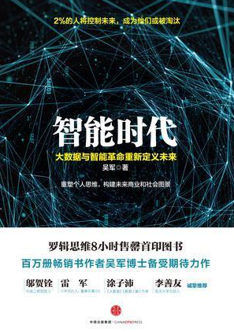
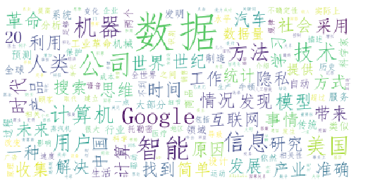

# 封面

# 简介
大数据和机器智能的出现，对我们的技术发展、商业和社会都会产生重大的影响。作者吴军在《智能时代：大数据与智能革命重新定义未来》中指出，首先，我们在过去认为非常难以解决的问题，会因为大数据和机器智能的使用而迎刃而解，比如解决癌症个性化治疗的难题。同时，大数据和机器智能还会彻底改变未来的商业模式，很多传统的行业都将采用智能技术实现升级换代，同时改变原有的商业模式。大数据和机器智能对于未来社会的影响是全方位的。
目录
 - 现象、 数据、 信息和知识
 - 数据的作用： 文明的基石
 - 相关性： 使用数据的钥匙
 - 统计学： 点石成金的魔棒
 - 数学模型： 数据驱动方法 的基础
 - 什么是机器智能
 - 鸟飞派： 人工智能1.0
 - 另辟蹊径： 统计+数据
 - 数据创造奇迹： 量变到质 变
 - 大数据的特征
 - 变智能问题为数据问题
 - 思维方式决定科学成就： 从欧几里得、 托勒密到牛 顿
 - 工业革命， 机械思维的结 果
 - 大数据的本质
 - 从因果关系到强相关关系
 - 从大数据中找规律巨大的商业利好:相关性、 时效性和个性化的重要性
 - 把控每一个细节
 - 重新认识穷举法 完备
 - 从历史经验看大数据的作 用
 - 技术改变商业模式
 - 加（+)大数据缔造新产业
 - 技术的拐点
 - 数据收集： 看似简单的难 题
 - 数据存储的压力和数据表 示的难题
 - 并行计算和实时处理： 并 非增加机器那么简单
 - 数据挖掘： 机器智能的关 键
 - 数据安全的技术
 - 保护隐私： 靠大数据长期 挣钱的必要条件
 - 未来的农业
 - 未来的体育
 - 未来的制造业
 - 未来的医疗
 - 未来的律师业
 - 未来的记者和编辑
 - 智能化社会
 - 精细化社会
 - 无隐私的社会
 - 机器抢掉人的饭碗
 - 争当2%的人

# 云图

