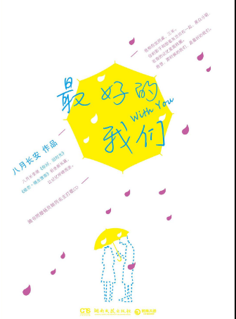
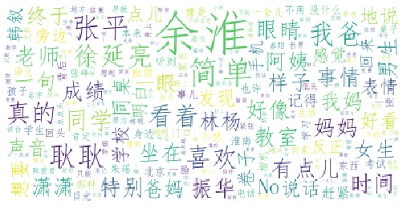

# 封面

# 简介
内容推荐
　　你总是说青春从不曾永远，而那时候的我们，就是最好的我们。
　　这一次，让我们和耿耿、余淮、余周周、林杨、洛枳、盛淮南一起和整个青春做告别。
　　八月长安全新力作。
　　你还记得高中时的同桌吗？那个少年有世界上最明朗的笑容，那个女生有世界上最好看的侧影。高中三年，两个人的影子和粉笔灰交织在一起，黑白分明，在记忆里面转圈。本书以怀旧的笔触讲述了女主角耿耿和男主角余淮同桌三年的故事，耿耿余淮，这么多年一路走过的成长故事极为打动人心，整个故事里有的都是在成长过程中细碎的点点滴滴，将怀旧写到了极致，将记忆也写到了极致。

# 云图

