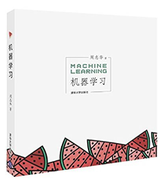
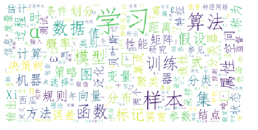

# 封面

# 简介
该书有以下特点：
1. 内容系统全面。全书16章，覆盖了机器学习几乎所有的主要分支领域，覆盖面超过了该领域国际著名书籍如ESL与PRML：
第1 部分（第1-3 章）介绍机器学习的基础知识；
第2 部分（第4-10 章）介绍一些经典而常用的机器学习方法（决策树、神经网络、支持向量机、贝叶斯分类器、集成学习、聚类、降维与度量学习）；
第3 部分（第11-16 章）为进阶知识，内容涉及特征选择与稀疏学习、计算学习理论、半监督学习、概率图模型、规则学习以及强化学习。
此外，书中每章都提供了精心总结的阅读文献，对读者进一步深造提供了极大帮助。
2. 行文通畅易读。
作者文笔精彩，全书思路清晰、文字活泼通畅，每章附带的小故事让读者在轻松之余了解学科相关历史。尤为难得的是，作者很善于把复杂的事情说得简单明白，避免数学公式的堆砌，重在说清技术内容的来龙去脉，让读者不仅“知其然”，还要“知其所以然”。这不仅对初学者有益，对本领域研究者了解学科全局的发展思路也很有帮助。另外，该书对关键的公式又有具体详尽的推导分析。
3. 叙述立场客观。
作为入门教科书，尽可能不带偏见地对材料进行客观介绍**重要。以往的一些书籍在此方面有失偏颇，如PRML把所有机器学习材料都从贝叶斯角度来诠释描述，这对高水平读者很有益，能让人看到各种内容均可以从不同学派的角度来理解；但是对入门读者，先入为主地强化单一学派的思路和价值观，对深入理解整个学科未必有益。周教授《机器学习》书各种材料均从其本源产生的角度来介绍，令细心读者对各学派的优点都能有所体会，对入门者**有益。
4. 设计装帧精美。
该书近似方形开本，注释以边注形式出现，侧边空白便于读者写笔记，设计很人性化。文字、公式、数学符号混排格式美观精致。特别是，彩图是彩印的！纸张也相当好，足以看出作者和出版社的用心。封面设计清新文艺。该书可谓技术类书籍中的艺术品，令人爱不释手。

# 云图

