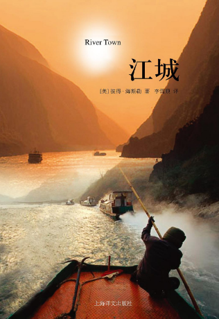

# 封面

# 简介
一个27岁的牛津大学英语文学硕士；一个曾经自助旅游跑完半个地球的美国年轻人，于1996年参加和平队深入中国腹地，在四川涪陵师专担任了两年英语老师。《江城》这本书就是作者何伟对这段特殊经历的纪录和思考。

在仅仅因为是外国人就可以上电视的90年代中期，何伟所深入的涪陵是一个闭塞的西南小城，几乎没有外国人路过，在一段时间内，何伟和另外一位“和平队”志愿者亚当是仅有的两个，他们的出现让当地人极为好奇，仅仅是用餐和购物就会引起“恐怖的”多达三十人的围观。但何伟没有因此把自己的活动范围局限在校园内，而是努力和当地百姓接触，带着同样的好奇和善意。在对面条店小老板、神父、农民、“小姐”各色人等仔细而准确的社会学家式观察中，何伟绘制了一幅90年代中期中国西南小城的社会景象，折射出小人物在文革、计划生育、改革开放、国有企业改革、三峡大坝建设等各种社会大事件中的命运沉浮。

在本书中，即能看到何伟与他学生的思想交流对撞，看他们如何在在文学中发现跨越语言和种族的共鸣；也能看到何伟对政治体制是怎样限制学生思维的观察和思考，书中所引用的一些学生的写作习作，足以唤起任何经历了那个时代的人的集体记忆。

# 云图

