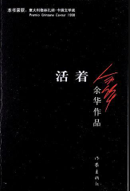
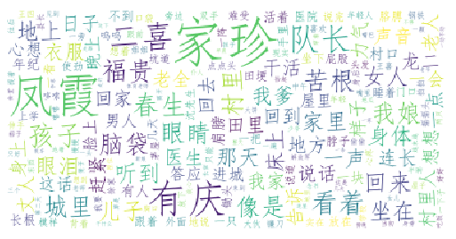

# 封面

# 简介
余华
我和现实关系紧张，说得严重一些，我一直是以敌对的态度看待现实。随着时间的推移，我内心的愤怒渐渐平息，我开始意识到一位真正的作家所寻找的是真理，是一种排斥道德判断的真理。作家的使命不是发泄，不是控诉或者揭露，他应该向人们展示高尚。这里所说的高尚不是那种单纯的美好，而是对一切事物理解之后的超然，对善与恶一视同仁，用同情的目光看待世界。 

正是在这样的心态下，我听到了一首美国民歌《老黑奴》，歌中那位老黑奴经历了一生的苦难，家人都先他而去，而他依然友好地对待世界，没有一句抱怨的话。这首歌深深打动了我，我决定写下一篇这样的小说，就是这篇《活着》，写人对苦难的承受能力，对世界乐观的态度。写作过程让我明白，人是为活着本身而活着的，而不是为活着之外的任何事物所活着。我感到自己写下了高尚的作品。

# 云图

