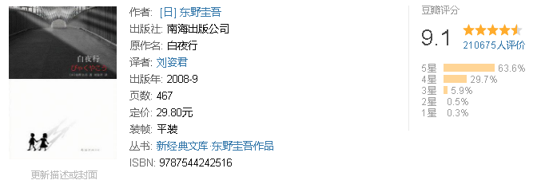
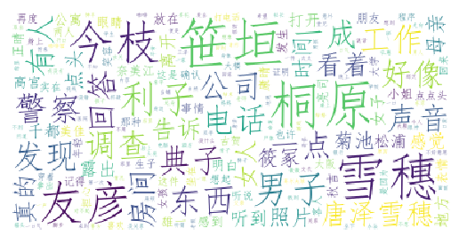

日本第一畅销书作家，文坛天王东野圭吾里程碑力作。日本亚马逊、纪伊国屋、三省堂畅销排行第1名，韩国阿拉丁、YES24、教保文库畅销排行第1名。同名日剧创造日本2007年度收视率纪录。绝望的念想，非恸的守望！我的天空里没有太阳，总是黑夜，但并不暗，因为有东西代替了太阳。虽然没有太阳那么明亮，但对我来说已经足够。凭借着这份光，我便能把黑夜当成白天。我从来就没有太阳，所以不怕失去。只希望能手牵手在太阳下散步，这个象征故事内核的绝望念想，有如一个美丽的幌子，随着无数凌乱、压抑、悲凉的故事片段像纪录片一样。

