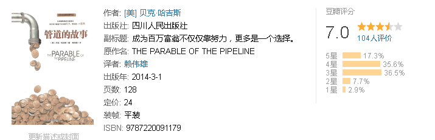

我们都生活在一个“提桶”的世界里：干一天的活儿拿一天的工钱，干一个月的工作领一个月的薪水。无论你是年收入不到1万元的洗碗工，还是年薪过百万的白领，你都是用一份时间去换一份金钱。如果你被解雇，或因患病、受伤无法继续工作，你的收入就会马上停止。不提桶，就没有收入！

如何摆脱时间换金钱的陷阱？如何获得真正的财务保障？只有管道！

本书将告诉你，为什么要建造管道，以及如何建造管道，让你彻底摆脱“提桶人”的命运，实现真正的财务自由！

