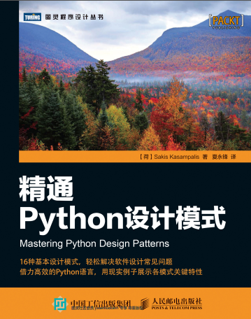
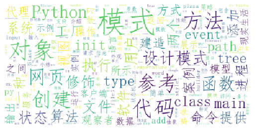

# 封面

# 简介
本书内容
第一部分，创建型模式，介绍处理对象创建的设计模式。
 第1章，工厂模式 介绍如何使用工厂设计模式（工厂方法和抽象工厂）来初始化对象，并说明与直接实例化对象相比，使用工厂设计模式的优势。
 第2章，建造者模式 对于由多个相关对象构成的对象，介绍如何简化其创建过程。
 第3章，原型模式 介绍如何通过完全复制（也就是克隆）一个已有对象来创建一个新对象。

第二部分，结构型模式，介绍处理一个系统中不同实体（类、对象等）之间关系的设计模式。
 第4章，适配器模式 介绍如何以最小的改变实现已有代码与外来接口（例如，一个外部代码库）的兼容。
 第5章，修饰器模式 介绍如何无需使用继承也能增强对象的功能。
 第6章，外观模式 介绍如何创建单个入口点来隐藏系统的复杂性。
 第7章，享元模式 介绍如何通过复用一个对象池中的对象来提高内存利用率及应用性能。
 第8章，模型—视图—控制器模式 介绍如何避免业务逻辑与用户界面代码的耦合，提高应用的可维护性。
 第9章，代理模式 介绍如何增加额外的保护层，提高应用的安全性。

第三部分，行为型模式，介绍处理系统实体之间通信的设计模式。
 第10章，责任链模式 介绍如何向多个接收者发送请求。
 第11章，命令模式 介绍如何让应用能够取消已经执行的操作。
 第12章，解释器模式 介绍如何基于Python创建一种简单的语言，便于领域专家使用，而无需学习Python编程。
 第13章，观察者模式 介绍如何在对象发生变化时，通知已注册的相关者。
 第14章，状态模式 介绍如何创建一个状态机以对问题进行建模，并说明这种技术的优势。
 第15章，策略模式 介绍如何基于某些输入标准（例如，元素大小）在程序运行期间从多个可用算法中选择一个。
 第16章，模板模式 介绍如何明确区分一个算法的通用与不通用部分，以避免不必要的代码复制。

# 云图

