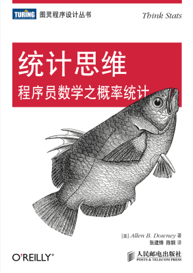

# 封面

# 简介
本书是一本全新的概率统计入门教材，重点介绍如何用统计学方法分析大型数据集。
本书会介绍如何使用计算机实现各种统计方法，这有诸多优点。
 - 学生可以通过编写程序来深化和检查自己对概念的理解。 例如， 编写计算最小二乘拟合、 残差和判定系数的函数， 编写和测试这些代码需要他们正确理解相关概念，消除各种可能的误解。
 - 学生能够通过计算实验来验证统计学上的一些定理。 例如， 生成服从各种分布的样本来验证中心极限定理（Central Limit Theorem，CLT）。 当发现服从帕累托分布的样本并没有收敛到正态分布时， 他们肯定会记住中心极限定理的前提条件。
 - 有些从数学上很难理解的概念可以很容易地用模拟方法来阐述。 例如，通过蒙特卡罗模拟近似求出 p 值，就能说明 p 值的含义。
 - 使用离散分布和计算方法可以把贝叶斯模拟之类在入门课程中很少见的内容讲清楚。 例如， 本书中有个练习要求学生计算“德国坦克问题”（German tank problem） 的后验分布， 通过理论分析很难得到答案，但用计算手段却很容易得出结果。
 - 因为学生使用的是通用编程语言 Python， 所以他们可以导入各种来源的数据，并不局限于那些已经为特定统计工具整理好的数据。本书内容是按项目来组织的。 
 
为了演示我想要学生做的分析， 本书会有一个贯穿全书的实例。 它所使用的数据主要有以下两个来源。
 - 由美国疾病控制与预防中心（Centers for Disease Control and Prevention，CDC） 主持的全国家庭成长调查（National Survey of Family Growth，NSFG） 项目，该项目是为了收集美国人的“家庭生活、婚姻状况、生育、避孕和男女健康等信息”。
 - 由全国慢性病预防和健康促进中心主导的行为风险因素监测系统（theBehavioral Risk Factor Surveillance System， BRFSS）， 该系统旨在跟踪“美国人的健康状况和危险行为” 。
 - 其他例子所使用的数据则来自 IRS（美国国税局）、 美国人口普查和波士顿马拉松比赛。

# 云图

