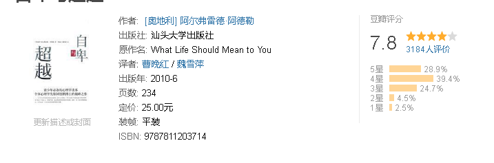

《自卑与超越》内容简介：阿尔弗雷德·阿德勒是与弗洛伊德齐名的心理学大师，他的心理学观点不仅适用于父母和了女间的关系，而且也可以涵盖师生关系。在维也纳，阿德勒有众多的追随者。1927年，他受聘为哥伦比亚大学讲座教授。1932年，他又受聘为日本长岛医学院教授。1935年，他创办了国际个体心理学学刊。1937年，阿德勒受聘赴欧洲讲学。由于四处争聘，他有时甚至一天之内要分赴两个城市演讲。由于过分劳累，他终于因为心脏病发作，猝死在苏格兰亚伯丁市的街道上。

