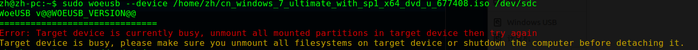
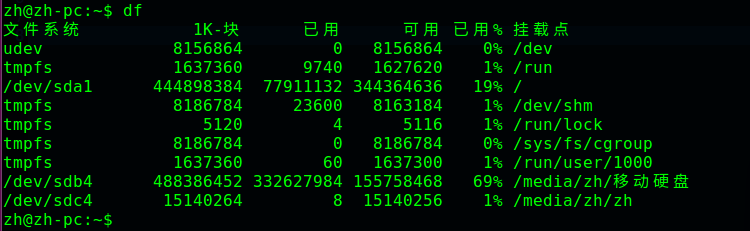
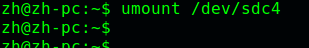
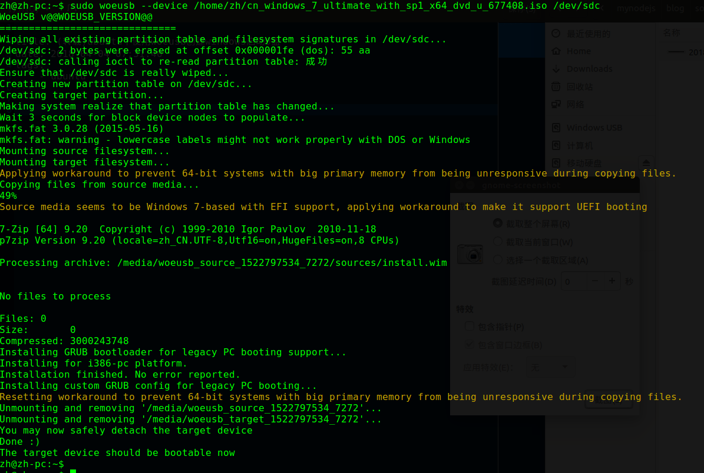

ubuntu(16.04)创建windows启动U盘，使用woeusb，而不是dd

使用dd创建经常不能启动，听说是必须使用isohybrid转换以后才能到u盘（另外，对于克隆linux系统，如果已经有现成的linux系统，安装一个squashfs-tools,直接把光盘里的根unsquashfs拷贝到一个分区，然后chroot进去改一下密码就行了）

那么我们必须使用另外一个工具：woeusb

安装：

```
sudo add-apt-repository ppa:nilarimogard/webupd8  
sudo apt update   
sudo apt install woeusb  
```
图形界面的使用就不讲了，讲了命令行的：
```
sudo woeusb --device </path/to/windows.iso> <device>  
for example  
sudo woeusb --device /home/windows.iso /dev/sdc  
```
Update: if you get an error like this: "Error: Partition(s) on /dev/sdb are being used" when WinUSB / WoeUSB tries to format the USB stick from the command line, or "Error 256" in the beginning of the process when using the GUI, you must unmount the partitions. Firstly, to get a list of partitions, run the following command ("mount" also works):
```
df -aTh  
```
This should list all the partitions mounted on your system. If you got here, you should already know the USB device drive, e.g. /dev/sdc, so you need to look for the partitions (it could also only be one) on this drive, like /dev/sdc1, /dev/sdc2, etc. Then, unmount them like this (example):
```
sudo umount /dev/sdc1  
sudo umount /dev/sdc2  
```
 










