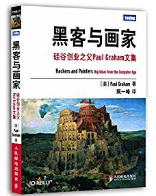

《黑客与画家:硅谷创业之父Paul Graham文集》是硅谷创业之父Paul Graham的文集，主要介绍黑客即优秀程序员的爱好和动机，讨论黑客成长、黑客对世界的贡献以及编程语言和黑客工作方法等所有对计算机时代感兴趣的人的一些话题。书中的内容不但有助于了解计算机编程的本质、互联网行业的规则，还会帮助读者了解我们这个时代，迫使读者独立思考。 　　
《黑客与画家:硅谷创业之父Paul Graham文集》适合所有程序员和互联网创业者，也适合一切对计算机行业感兴趣的读者。

